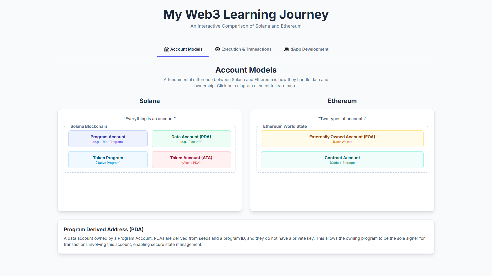

# My Web3 Learning Journey: Solana vs. Ethereum

This repository documents my ongoing Web3 development learning journey, focusing on core blockchain concepts and practical dApp development. It features an interactive single-page web application (SPA) designed to visualize and compare fundamental architectural models and development paradigms of Solana and Ethereum.

The goal of this project is to synthesize complex blockchain information into an easily digestible and explorable format, making the learning process more intuitive and engaging.

## Interactive Learning Application

Explore the live interactive application that summarizes key concepts:

* **Account Models:** A side-by-side comparison of Solana's "everything is an account" model (Program Accounts, PDAs, Token Accounts) and Ethereum's Externally Owned Accounts (EOAs) vs. Contract Accounts. Click on elements to reveal detailed explanations.
* **Execution & Transactions:** Understand how transactions are structured and executed on both blockchains, including Solana's instructions and Ethereum's transaction object fields.
* **dApp Development Concepts:** Dive into essential frontend development tools like React Hooks (`useState`, `useEffect`) and Ethereum's Application Binary Interface (ABI), with code examples.

### Screenshot



## Technologies Used

* **Frontend:** HTML, CSS (Tailwind CSS)
* **Interactivity:** Vanilla JavaScript
* **Concepts Covered:** Bitcoin fundamentals, Cryptography, Solana Accounts (PDAs, Tokens), Ethereum Accounts (EOAs, Contracts, EVM, ABI), React Hooks.

## How to Run Locally

1.  **Clone the repository:**
    ```bash
    git clone [https://github.com/ShreyasThakur0809/Shreyas-Web3-.git](https://github.com/ShreyasThakur0809/Shreyas-Web3-.git)
    ```
2.  **Navigate to the project directory:**
    ```bash
    cd Shreyas-Web3-
    ```
3.  **Open `index.html`:** Simply open the `index.html` file in your web browser. No local server is required as it's a single HTML file.

---

_This project is a living document, continuously updated as I delve deeper into Web3 development._
